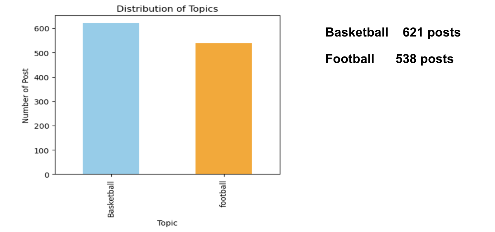
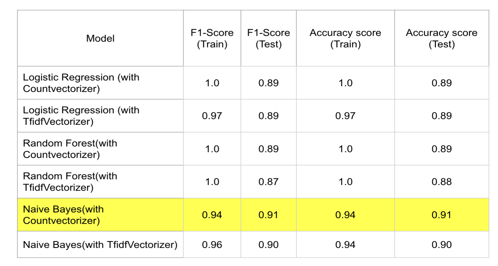

# SportTopic Categorizer

## Project Name : SportTopic Categorizer 
**Description :** The filter that will help categorize posts about football and basketball that have come in abundance in webpage

| Feature       | Dataset                               | Description                             |
|:----------------:|:-------------------------------------:|:--------------------------------------:|
| **subreddit**    | Basketball.csv, Football.csv | The category of the post |
| **title** | Basketball.csv, Football.csv | Title of the post |
| **selftext**  | Basketball.csv, Football.csv | The content of that post       |

As a newly launched sports community website call **"Sport today** , we have seen a rapid influx of users who are enthusiastic about discussing various sports topics. However, with the increasing diversity of posts, we've noticed that the majority of our users are avid fans of football and basketball. This diversity has led us to the realization that we need a tool to effectively categorize posts based on the type of sports discussed.

To address this, let's imagine our platform as a space where sports enthusiasts gather to engage in discussions. Given that a significant portion of our user base is interested in both football and basketball, we aim to create a tool that can intelligently categorize posts into these specific sports categories. Observing similarities in text patterns with platforms like Reddit, we've decided to leverage Reddit's rich source of labeled data for training our model.

Our goal is to extract relevant data from Reddit, utilizing its vast repository of information. The pre-labeled data from Reddit will serve as the foundation for training our model to accurately categorize posts into football and basketball topics. This project stems from the need to enhance the user experience on our platform by offering a tailored and organized space for discussions on football and basketball.

By implementing this text classification model, we aspire to create a seamless and user-friendly environment for our sports community, ensuring that users can easily find and participate in discussions related to their favorite sports. This project is an exciting step towards providing a personalized and engaging experience for sports enthusiasts on our platform.

**Objective:**
1. Build a robust text classification model capable of accurately predicting the topic of a post as either basketball or football.
2. Identify key features and characteristics within the text data that contribute to accurate classification.
3. Evaluate the model's performance on a comprehensive test set to ensure generalization.

## Problem Statement
In an online community platform, users often engage in discussions across a wide range of sport topics. However, with an increasing volume of content, it becomes challenging for users to navigate and find posts that align with their specific interests. To address this issue, we aim to develop a text classification model that can accurately categorize posts of two categories: "Basketball" and "Football" 

**Questions:**  
1. How can we effectively differentiate between posts related to basketball and football?
2. What features of the text data are most influential in making accurate classifications?
3. How can we ensure the model performs reliably on unseen posts?

**Solution :**
The proposed solution involves implementing a pipeline that combines text preprocessing techniques, including tokenization, lemmatization, and stop word removal, with a machine learning classifier. The selected classifier, `Logistic regression`, `Naive Bayes`, `Random Forest`, is trained on a labeled dataset containing posts from both the "Basketball" and "Football" posts. The trained model is then capable of predicting the topic of new, unseen posts with a high degree of accuracy.

**Exploratory Data Analysis And Cleaning Data**
1. Collecting data  
    - Basketball.csv ( 7441 rows , 114 columns ) 
    - Football.csv = ( 7431 rows , 114 columns ) 
2. Merging the data from "basketball.csv" and "football.csv" into one dataframe and Drop duplicate , Drop Null values
3. Use  regular expression character that is not an alphabetical letter (lowercase or uppercase) or a whitespace character replace with  withespace
4. Remove words  “football” , “basketball” from all of text
5. Lemmatizer
6. Change Subreddit to Topic_encoded 
    - 0 : Basketball 
    - 1 : Football

**Cleaned data after drop null values , drop duplicate**

## Conclusion and Recommendation

The developed text classification model demonstrates strong performance in accurately categorizing posts into the "Basketball" and "Football" topics. Key features such as `selftext` , `title` were found to significantly influence classification outcomes. The model showcases `Naive Bayes` with `Countvectorizer` performance is highest Accuracy.

The best hyperparameters for this model are 
   - cvec__max_df : 0.9 
   - cvec__max_features : 3000 
   - cvec__min_df: 2 
   - cvec__ngram_range : (1, 2)
   - nb__alpha': 1
   - nb__fit_prior : True

In evaluating the effectiveness of utilizing the `Title+Selftext` features, we observed that this combination produced the most promising results. The `Naive Bayes model`, coupled with `CountVectorizer`, demonstrated outstanding performance, achieving an impressive `F1-score` of 0.94 on the training set and 0.91 on the unseen dataset . Additionally, the `Accuracy score` was 0.94 on the training set and 0.91 on the unseen dataset which is highly satisfactory

To further interpret the model's decisions, we identified specific keywords that strongly contribute to the classification of posts into football and basketball categories:

- For Football-related posts:
  - 'world cup'
  - 'champion league'
  - 'ballon d'or'
  - 'real madrid'
  - 'premier league'

- For Basketball-related posts:
  - 'high school'
  - 'pickup game'
  - 'shooting guard'
  - 'nba team'
  - 'offensive player'

We recommend continuous monitoring of the model's performance through the implementation of a robust monitoring system. This proactive approach allows for the timely identification of any shifts in data distribution or potential performance degradation. Such monitoring is crucial to ensure the model remains effective and adaptive in the dynamic environment of the online community platform and If the categorization of football and basketball proves to be well-received, we can extend our capabilities to classify other sports. However, currently, the majority of users show the highest enthusiasm for basketball and football

**Impact:**

1. **Enhanced User Experience:** The implementation of the text classification model will streamline content discovery for users, allowing them to quickly find and engage with posts that align with their specific interests.
2. **Improved Community Engagement:** By accurately categorizing posts, users are more likely to participate in discussions, leading to increased interaction and a more vibrant community.
3. **Time and Resource Efficiency:** Automating the categorization process reduces the need for manual sorting and tagging of posts, saving both time and human resources.
4. **Data-Driven Insights:** The model can provide valuable insights into user preferences and popular topics, which can inform content curation and community management strategies.

**Limitations**
1.The limitation in collecting data from the subreddit is that I attempted to gather information from a total of 3,000, 7,000, and 14,000 posts, but it seems that after removing duplicated data, only around 600 posts remain.
